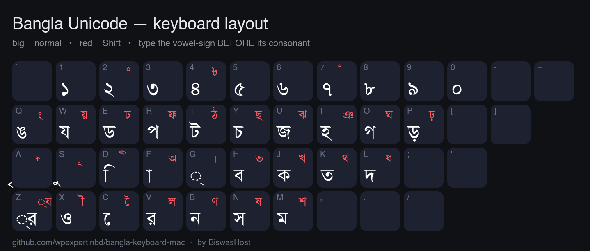

# Bangla Keyboard Layout for Mac

A modern, free **Bangla keyboard layout installer for macOS** (Apple Silicon &
Intel). It installs the traditional **fixed (positional) Bangla layout** —
typed the same way as on Windows — a **phonetic layout** (type Bangla the way it
sounds: `ami` → আমি), plus a set of free Unicode Bangla fonts.

> **Status: shipping — `v1.7.0`** (keyboard `.pkg`/`.dmg` + optional `Bangla Voice` companion).
>
> Built and maintained by **[BiswasHost](https://www.biswashost.com)**.
> No Java; just native macOS keyboard layouts (voice typing is a small optional menu-bar app).

<p align="center">
  
  &nbsp;&nbsp;
  
  &nbsp;&nbsp;
  
</p>

## What you get

| Layout | Output | Use with |
|---|---|---|
| **Bangla Unicode** | Proper Unicode Bangla (U+0980 block) | Any Unicode Bangla font (14 included) |
| **Bangla Classic** | Legacy ASCII encoding for "MJ"-family fonts | a legacy ANSI Bangla font (see note below — not included) |
| **Bangla Phonetic** | Proper Unicode Bangla, typed by sound (`ami` → আমি) | Any Unicode Bangla font (14 included) |
| **14 free fonts** | SolaimanLipi, Kalpurush, Siyam Rupali, AdorshoLipi, Lohit, Mukti, Akaash, … | installed to `/Library/Fonts` |

### Natural, Windows-style typing
The **Bangla Unicode** layout reproduces the familiar fixed-layout typing order,
including the things people miss on other Mac layouts:

- Type the vowel-sign **before** its consonant (prebase) — it attaches to the
  right letter: `ম ে ন → মনে`, `ত ে ব → তবে`, `ে ক ন → কেন`.
- Conjuncts ride through correctly: `ি ক ্ ষ → ক্ষি`, `হ চ ে ্ ছ → হচ্ছে`.
- Reph after a consonant: `স Shift+A → র্স` (`ভার্সন`).
- ya/ra-fola: `ি ফ ্র → ফ্রি`. Independent vowels: `স ে G ি → সেই`.

## 🔤 Phonetic typing — Bangla Phonetic

Type Bangla **the way it sounds**, with the conventions Bangladeshi typists already
know. Bangla appears **as you type** (the last letter or two stay underlined until
the word settles). No app, no permissions — it is a normal keyboard layout.

| Type | Get | | Type | Get |
|---|---|---|---|---|
| `ami tumi kemon` | আমি তুমি কেমন | | `bangla`, `rongin` | বাংলা, রঙিন |
| `bhalO`, `sOnar` (`O` = ো) | ভালো, সোনার | | `golpo`, `okkhor`, `biggo` | গল্প, অক্ষর, বিজ্ঞ |
| `keno`, `bhalo` (plain `o` is silent) | কেন, ভাল | | `korrmo` (`rr` = reph) | কর্ম |
| `c` / `ch` | চ / ছ | | `bybohar` (`y` = য-ফলা) | ব্যবহার |
| `s` / `sh`, `S` / `Sh` | স / শ / ষ | | `bishwo` (`w` = ব-ফলা) | বিশ্ব |
| `t T d D n N r R` | ত ট দ ড ন ণ র ড় | | `krriShok` (`rri` = ৃ / ঋ) | কৃষক |
| `.` `,,` `^` `:` `$` | । ্ ঁ ঃ ৳ | | ``jan`te`` (`` ` `` keeps letters apart) | জানতে |

Conjuncts form automatically. A keyboard layout cannot carry a dictionary, so a few
common words are built in as exceptions (`amra` আমরা, `tOmra` তোমরা, `ekTa` একটা,
`apni` আপনি); elsewhere put `` ` `` between two consonants to keep them apart.
The rules are our own (MIT) and are generated by
[`src/phonetic/gen_phonetic.py`](src/phonetic/gen_phonetic.py), with a regression
corpus in [`src/phonetic/tests.tsv`](src/phonetic/tests.tsv).

## Keyboard layout

<p align="center">
  
</p>

Big white glyph = normal key; small red glyph = **Shift**. `◌` marks a vowel-sign
(matra) or fola. Type the vowel-sign **before** the consonant it belongs to.

## Install

This build is **not code-signed** (no paid Apple Developer ID), so macOS
Gatekeeper will block a plain double-click. Pick whichever is easier:

### ✅ Easiest — the installer package (`.pkg`)
1. From the [**latest release**](https://github.com/wpexpertinbd/bangla-keyboard/releases/latest) download **`Bangla Keyboard.pkg`**.
2. Double-click it → macOS blocks it → click **Done**, then **System Settings →
   Privacy & Security → Open Anyway** (right-click → Open no longer works on recent macOS).
3. Follow the installer and enter your admin password.

### Or — the installer app (adds Reinstall / Uninstall)
1. From the [**latest release**](https://github.com/wpexpertinbd/bangla-keyboard/releases/latest) download the **`.dmg`** and open it.
2. Try to open **`Bangla Keyboard Installer`** once → macOS blocks it.
3. **System Settings → Privacy & Security**, scroll down, click **"Open Anyway"**,
   then open the app again. It offers **Install / Reinstall / Uninstall**.

### After installing (either way)
1. **Log out and log back in** (or restart) — macOS caches keyboard layouts.
2. **System Settings → Keyboard → Text Input → Edit… → `+` → Bangla** → add
   **Bangla Unicode**, **Bangla Classic** and/or **Bangla Phonetic**.
3. Switch input with the menu-bar flag icon or **Control-Space**.

### "App is damaged and can't be opened"?
That's **Gatekeeper on an unsigned download — not real damage** (common on Apple
Silicon). Easiest fix: **use the `.pkg`** above. If you prefer the app, drag it
out of the disk image to (say) your Desktop, then in **Terminal** run:

```bash
xattr -dr com.apple.quarantine ~/Desktop/"Bangla Keyboard Installer.app"
```

…and open it. (This warning goes away entirely only with a notarized build,
which needs a paid Apple Developer ID.)

## 🎤 Voice typing (optional)

A small **menu-bar companion** (`Bangla Voice.app`) lets you dictate instead of type.
Download **`Bangla-Voice-macOS-*.zip`** from the
[**latest release**](https://github.com/wpexpertinbd/bangla-keyboard/releases/latest),
unzip, and open the app (unsigned → click **Done**, then *Open Anyway* in
**System Settings → Privacy & Security**). The first time, allow **Accessibility**
(Privacy & Security → Accessibility) so it can type at the cursor.

- **⌃⌥S** = Bangla voice · **⌃⌥D** = English voice · press again (or the menu) to stop.
- **Free, nothing stored** — correct Bangladeshi **bn-BD** + English via a free online
  speech service; the mic is live only while listening.
- **Punctuation is spoken** (say the mark alone after a pause): "দাঁড়ি"→। , "কমা"→, ,
  "প্রশ্ন"→? , "বিস্ময়"→! (English: "full stop" / "comma" / "question mark"). A word
  inside a sentence stays a word.
- Needs a microphone + internet. Details + privacy: [`voice/README.md`](voice/README.md)
  and [`../SECURITY.md`](../SECURITY.md).

## ⚠️ About the Bangla Classic layout (legacy ANSI fonts)

The **Bangla Classic** layout outputs the **legacy ASCII (non-Unicode)**
encoding that legacy ANSI ("MJ"-family) Bangla fonts use. Those fonts are
**proprietary and are not included** in this project. To use the Classic layout
you must install a compatible legacy ANSI Bangla font **from your own legitimate
source**, then select that font in your app.

The **Bangla Unicode** layout has no such requirement — it works with any of the
bundled Unicode fonts (or system Bangla fonts).

### Typing ও‑কার / এ‑কার / ঐ‑কার in Classic (v1.1.0+)

Type the consonant **first**, then the vowel sign — **no space needed**:

- `স` then `ে` → **সে**, &nbsp; `স` then `ে` then `া` → **সো**, &nbsp; `ত` then `ে` then `া` → **তো**
- This is the natural (Windows‑style) order, and it means **Space is always a clean
  word‑separator** — so words like *আমার সোনার বাংলা* no longer stick together.

> Earlier builds used a leading **Space** to trigger the left‑side vowel; that
> accidentally ate the gap between words. If you used the old space habit, just
> drop the space. **After updating, remove and re‑add the Classic layout, then log
> out/in** — macOS caches keyboard layouts.

## Licensing — please read

- **This installer, the build scripts, the icons, and the keyboard-layout
  modifications** are by BiswasHost and released under the **[MIT License](../LICENSE)**.
- **The bundled fonts** are free/libre and stay under **their own** licenses
  (GNU GPL or SIL OFL). Full details and license texts:
  [`fonts-licenses/`](fonts-licenses/) and [`fonts-licenses/FONTS.md`](fonts-licenses/FONTS.md).
- This is an **unofficial, community project** and is **not affiliated with any
  commercial keyboard or font vendor**. See **[DISCLAIMER.md](../DISCLAIMER.md)**.
  Fonts not included for licensing reasons: the five **Nikosh** fonts
  (CC BY-NC-ND) and all **MJ**-family fonts (proprietary).

## Build from source

```bash
src/build/build.sh 1.0.0
# → dist/Bangla Keyboard.pkg  and  dist/Bangla Keyboard.dmg
```

Requirements: macOS with the standard command-line tools (`pkgbuild`,
`productbuild`, `hdiutil`). The keyboard layouts live in `src/keylayouts/`, the
fonts in `src/fonts/`, and the icons in `assets/`.

## Notes

- **Standard keyboard shortcuts keep working** — `⌘C` / `⌘V` / `⌘X` (copy/paste/cut)
  and every other `⌘` command fire normally while a Bangla layout is active, so you
  don't have to switch back to English to copy or paste.
- Unsigned build: the first time, macOS blocks it — use **System Settings → Privacy & Security → Open Anyway**.
- Works on macOS 11 (Big Sur) and later, Apple Silicon and Intel.
- The last letter of a word appears when you press the next key or space — this
  is normal for fixed-layout reordering.

---

Made with care by **[BiswasHost](https://www.biswashost.com)** 🇧🇩
